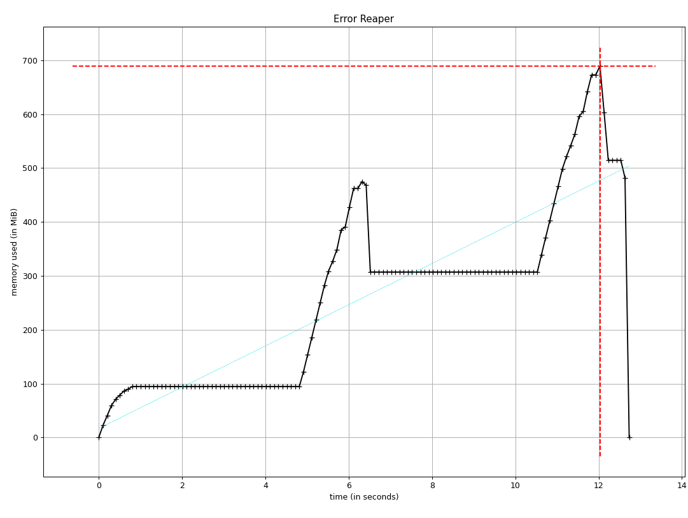
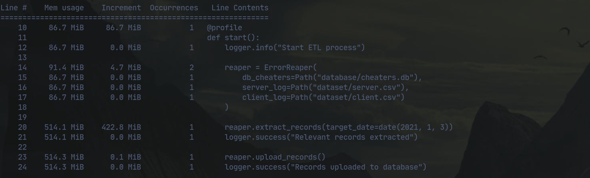

[](https://www.gnu.org/licenses/gpl-3.0)

<br>

# Тестовое задание для `#Meowpunk`

<br>

Есть два файла `client.csv` и `server.csv`. В **SQLite** есть таблица `cheaters`.

* Поля `client.csv`:
```yaml
- timestamp
- player_id
- error_id
- json
```

* Поля `server.csv`:
```yaml
- timestamp
- event_id
- error_id
- json
```

* Поля таблицы `cheaters`:
```yaml
- player_id integer
- ban_time string
```

<br>

## Задача 1

Создать в **SQLite** пустую таблицу с полями:
```yaml
- timestamp
- player_id
- event_id
- error_id
- json_server
- json_client
```

<br>

## Задача 2

Написать класс или функцию, которая:

* Выгрузит данные из `client.csv` и `server.scv` за определенную дату
* Объединит данные из этих таблиц по `error_id`
* Исключит из выборки записи с `player_id`, которые есть в таблице `cheaters`, но только в том случае, если `ban_time` у `player_id` — это предыдущие сутки или раньше относительно `timestamp` из `server.scv`
* Выгрузит данные в таблицу, созданную в **задаче 1**. В ней должны быть следующие данные:
```yaml
- timestamp    # из server.csv
- player_id    # из client.csv
- event_id     # из server.csv
- error_id     # из сджойненных server.csv и client.csv
- json_server  # поле json из server.csv
- json_client  # поле json из client.csv
```

<br>

## Задача 3*
Замерить потребление памяти во время выполнения задачи

<br>

### Результат:



<br>
<br>

## P. S.
* Можно использовать любые библиотеки
* Можно гуглить
* Большим плюсом является структурированность кода и соответствие PEP
